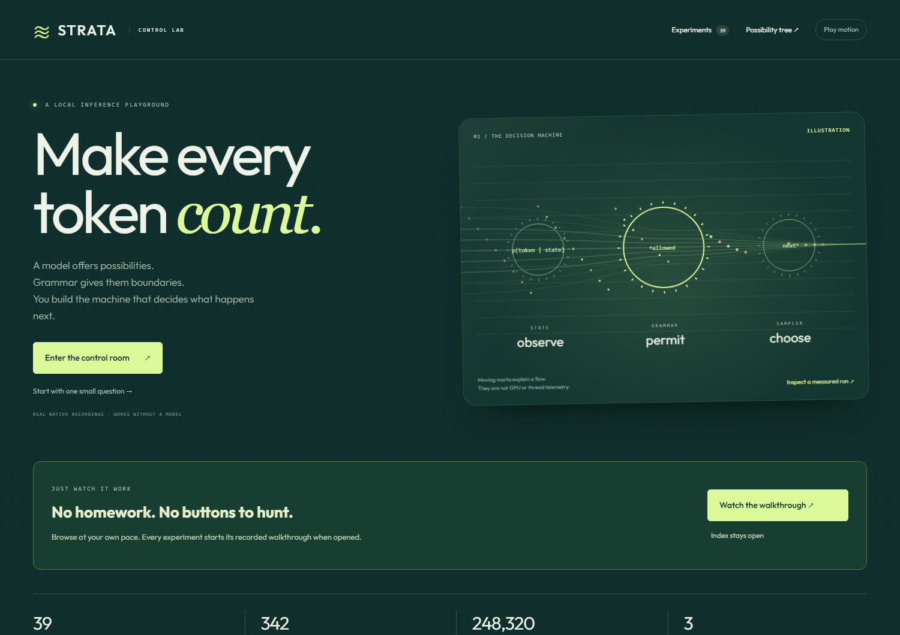

# Strata Control Lab

**Watch a model's preferences become decisions you can inspect.**

39 animated experiments explore logprobs, GBNF, JSON, sampler order and feedback
control. Start with yes/no questions, then follow games, document graphs,
grammar pressure, semantic sensitivity and small worlds with exact referees.
Every page shows its request, rules, measurements and a runnable Python example.

**[Watch the Control Lab video on YouTube](https://www.youtube.com/watch?v=yCFbqbt7rH0).**



The first run uses **342 bundled native recordings**. You need Python 3.11 or
newer, but no model, GPU, Node, database or Strata checkout. Dependency
installation needs internet access; the recorded tour works offline afterward.

## Start the lab

Download this repository with GitHub's **Code → Download ZIP** and extract it,
or clone it. Open a terminal in the extracted repository folder.

**Windows PowerShell**

```powershell
py -m venv .venv
.\.venv\Scripts\python.exe -m pip install .
.\.venv\Scripts\python.exe -m control_lab
```

**Ubuntu / Linux**

```sh
python3 -m venv .venv
.venv/bin/python -m pip install .
.venv/bin/python -m control_lab
```

Open **[localhost:8876](http://127.0.0.1:8876)** and leave the terminal running.
The index starts the recorded tour after 12 seconds. Each page walks through its
example, opens the next page and eventually loops. **Pause / explore** lets you
take over. Press **Ctrl+C** in the terminal to stop the server.

If port 8876 is occupied, add `--port 8877` and open that port instead. Ubuntu
may require `sudo apt install python3-venv` before creating the environment.
The [getting-started guide](docs/GETTING_STARTED.md) covers controls, downloads
and connecting your own model.

## Try the examples without the website

[Download all 39 examples with raw/derived score explanations](control_lab/static/strata-control-lab-39-raw-score-examples.zip).
The [original qualified ZIP](control_lab/static/strata-control-lab-39-offline-examples.zip) remains available, unchanged.
On its GitHub file page, use **Download raw file**, then extract it.

```sh
python strata-choice-example.py
python strata-samplers-example.py --all
python strata-pressure-example.py --lesson-only --value 1
python strata-scene-example.py --request 1 --show
python strata-choice-example.py --tokens
```

Use `py` on Windows or `python3` on Linux if `python` is unavailable. These files
use only the standard library. They contain the actual calculations, exact
requests, constraints and recorded replies. Network use requires an explicit
`--live-url`; replay is the default.

## Read raw scores on the tokens

Every page now starts with **Raw layer / Derived view**, explaining that example's
source and transformations. Model-backed pages expose every captured request and
its native tokens; diagnostic token IDs are labeled separately, and synthetic,
timing and research pages explicitly state when no native token row exists.
The automatic tour visits these explanations on all 39 pages. Fresh Python
downloads include them and use `--tokens` to print every original token score.

Token chips show **raw ln p** and **raw p = exp(ln p)**. Click a chip for its original bytes and
alternatives. The full value remains in the exported token's `logprob` field;
the chip rounds only its display. Streaming shows incoming scores as they arrive.

From this source checkout, try the additional standard-library example:

```sh
python tools/inspect_raw_logprobs.py --case decision
python tools/inspect_raw_logprobs.py --case grammar
python tools/inspect_raw_logprobs.py --case stream --json
```

These replay existing native recordings. Add `--live-url http://127.0.0.1:8080`
to explicitly call a compatible Strata server. The original 39 examples, ZIP
and 342 recordings are preserved; the added raw-score ZIP keeps their original
native request/response pairs. See [raw scores versus decision weights](docs/RAW_TOKEN_LOGPROBS.md)
for the measured A/B comparison and the source branch required by issue #675.
The [39-page coverage report](docs/SCORE_VIEW_COVERAGE.md) records the browser,
tour, exported-example and installed-wheel checks for this distinction.

## What is inside?

| Start here | Then explore | Inspect the limits |
| --- | --- | --- |
| Choice, yes/no, rubric scores | Finite grammar branches and state controllers | Missing top-N labels stay unknown |
| Grammar and sampler order | Min-P, sigma, XTC and grammar pressure | Raw scores differ from sampled weights |
| Games and feedback loops | Graph reconstruction and semantic observers | Legal actions can still be poor decisions |
| Joint probability circuits | Control directions and counterexample search | Model scores are not calibrated truth |
| Small applied worlds | Proofs, compiler rewrites, circuits and transactions | Exact toy referees expose model mistakes |

[All 39 experiments](docs/EXPERIMENTS.md) ·
[Live Strata compatibility](docs/ENGINE_COMPATIBILITY.md) ·
[Evidence and limitations](docs/EVIDENCE.md) ·
[Contributing and tests](docs/DEVELOPING.md)

The UI's motion explains operations; it is not hardware telemetry. Native
recordings, simulations and analytical inputs are labeled. The tour never
starts an unattended loop of live model requests. The examples support learning
and bounded experiments, not claims of universal model superiority or measured
hardware roofline performance.

## A separate client for Strata

This repository contains the lab and its evidence. It calls a compatible Strata
server over HTTP when you select **Live model**. The inference engine, Responses
API, GBNF/JSON implementation, logprobs and native samplers remain in the
[Strata contributions](docs/ENGINE_COMPATIBILITY.md).

Extracted into fresh history from the lab developed in CC-David-CC's Strata
fork. See [provenance and attribution](ATTRIBUTION.md). This is an independent
educational project, not an official upstream Strata release. Code is MIT
licensed; the bundled font retains its OFL license.
