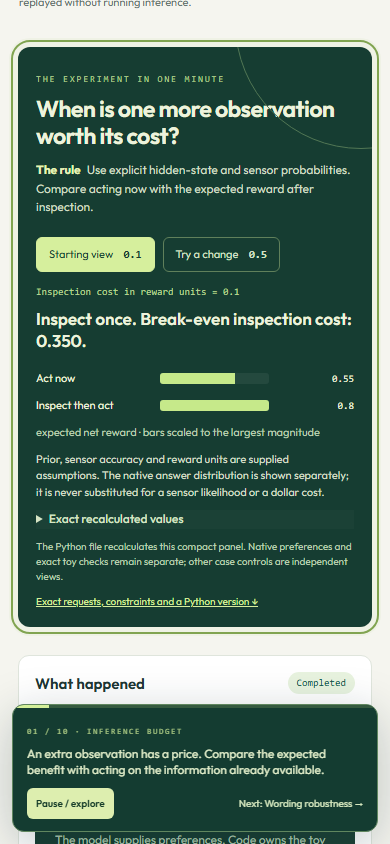

# Evidence and limits

The lab keeps three kinds of evidence separate: original native measurements,
checks of the standalone application, and an inherited engineering self-review.
Extraction does not turn a replay into a fresh inference run.

## Original native measurements

- [342 raw recordings](../control_lab/data/recordings) contain exact request and
  response data. Replay matches a canonical request hash; it never substitutes
  an unrelated result for an edited input.
- [Captured page results](../control_lab/data/captures) retain the derived state,
  traces and measurements used by tests.
- [Logprobs diagnostics](../control_lab/data/diagnostics/logprobs) preserve
  target, MTP, suffix and replay evidence from their distinct execution paths.
- [Sampler diagnostics](../control_lab/data/diagnostics/samplers) preserve
  native selector checks. [The applied-run identity](provenance/native-identity.json)
  identifies the llm-49 / RTX 4090 binary and source hashes. Paths and process IDs
  in identity files describe that historical machine, not installation paths.

The applied set adds 42 native requests covering 21 independent cases. It keeps
poor decisions visible: one inspection choice has 0.15 utility regret and one
ideal resistor choice exceeds the oracle's worst-case error by more than 2 V.
The bounded adversarial wording bank did not fool its greedy controller; the
page does not invent a successful attack.

Models, quantization, prompts and numerical paths affect these results. Token
probabilities describe the model's next-token distribution. Candidate weights
condition on a disclosed finite set. Semantic measurements are not automatically
calibrated event probabilities. Related measurements are not statistically
independent merely because they were requested separately.

## Extraction and standalone qualification

The [extraction check](validation/extraction-check.json) verifies the source data
and [39-example archive](../control_lab/static/strata-control-lab-39-offline-examples.zip)
are byte-identical to the extracted checkpoint. The [source manifest](provenance/extraction.json)
records original paths and hashes without depending on the original checkout.

The [standalone receipt](validation/RECEIPT.md) records installation, tests,
browser navigation and portable example checks. The app is exercised from an
installed wheel outside the source directory, with its model address unreachable.
This tests the application and its packaging; it does not retest Strata's engine.

The archive's [file hashes](provenance/archive.json) and
[original phase/export checks](provenance/portable-checks.json) remain available.
Scripts contain standard-library calculations and mocks. Editing a measurement
input requires a matching new fixture or an explicitly live request.

## Historical self-review

The inherited [39-page assessment](provenance/prior-assessment.json) has mean
9.40/10 and minimum 8.0/10 under the [frozen rubric](CONTROL_LAB_QUALITY_RUBRIC.md).
It is an engineering self-review, not independent user research, a design award
or a new score awarded during extraction. Historical screenshot collections and
old branch/PR material were intentionally omitted; two useful previews and the
underlying data are retained here.

The demonstrations do not establish general model reliability, controller
stability, real-world circuit safety, production transaction correctness or a
hardware roofline. Exact referees apply to the stated toy models. Each page's
next gate describes a more demanding test.
