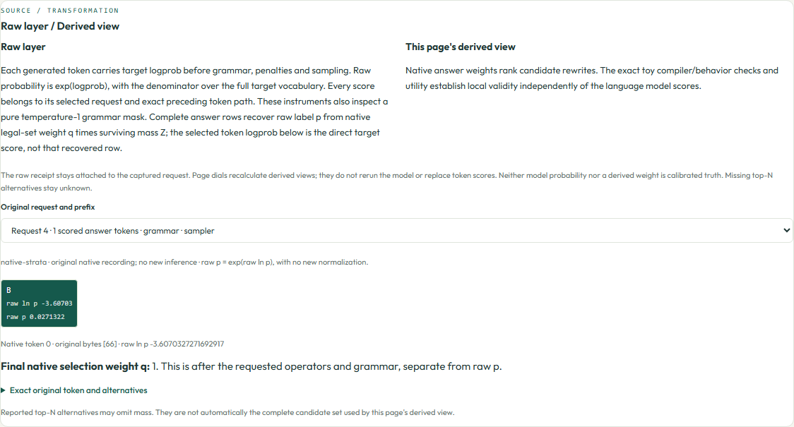
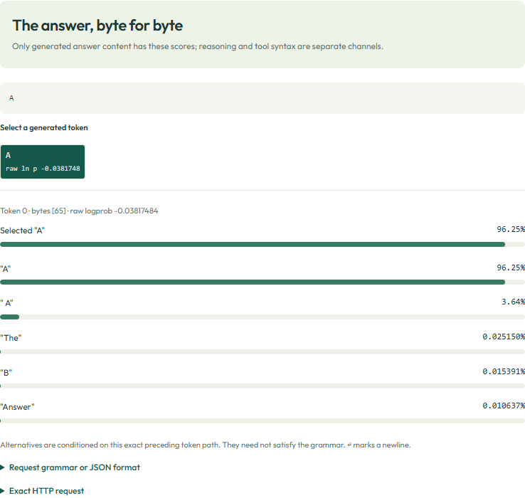
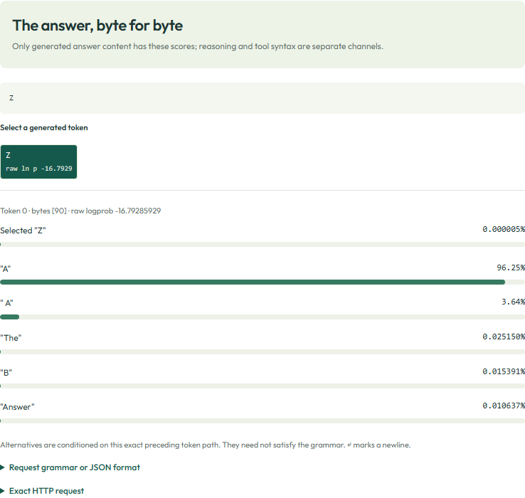

# Raw token log-probabilities and decision weights

Every one of the 39 pages has a visible **Raw layer / Derived view** explanation,
including the automatic tour and fresh Python exports. The raw-source panel lets
you select every request and its tokens, preserving the original prefix and
linking that selection to the exact request panel. It explains the page's own
normalization, sampler weight, semantic feature, utility or code result.
Synthetic, timing and research views do not receive invented native scores;
the speculation page labels its retained diagnostic token IDs separately.

The native Strata contribution already puts the raw target score on the token
itself: `choices[0].logprobs.content[i].logprob`. The lab now displays that value
on each token chip in the token inspector, finite grammar paths, native sampler
and grammar-pressure views, and on incoming streamed tokens. It preserves the
original `token`, `bytes`, `logprob` and `top_logprobs`; it does not retokenize text
or replace a raw score with a normalized decision weight. Chips round to six
significant digits for display; the tooltip, `data-logprob` and JSON receipt
retain the original value.

Chips also display raw probability `p = exp(logprob)`, using the same vocabulary
denominator. This is a representation change, not an extra model measurement.
The pure temperature-1 grammar instruments use a complete legal-set distribution
q and surviving mass Z to reconstruct raw label probabilities `p = q * Z` in
their semantic rows. Their raw-source panel separately shows the directly returned
selected-token logprob. Other sampler operators invalidate this pure-mask
reconstruction; those instruments enforce that contract.



In this recorded forced-commit request, B has raw p about `0.0271322` while native
selection q is `1`. The grammar commits the code-owned choice; it does not make
the original model preference certain. The request selector exposes that exact
prompt instead of mixing it with the earlier measurement requests.

The [updated 39-example ZIP](../control_lab/static/strata-control-lab-39-raw-score-examples.zip)
prints these page-specific explanations and supports `--tokens` for full raw
logprobs/probabilities and returned native selection weights. The
[original qualified ZIP](../control_lab/static/strata-control-lab-39-offline-examples.zip)
remains unchanged. Both retain the original native request/response pairs.

The [all-example coverage report](SCORE_VIEW_COVERAGE.md) lists the raw source,
captured request count and checked scores for each of the 39 pages.

## Which source supplies which behavior?

| Source | Meaning of the number |
| --- | --- |
| [Issue #675](https://github.com/Niko1221/Strata/issues/675) | Requests selected/top-N next-token scores on Chat Completions. Accepting request fields alone does not establish support. |
| [work/logprobs-675 at 2243cb1c](https://github.com/CC-David-CC/Strata-a5500/tree/2243cb1c5b1a87270731d8b8a76e4af001f96f97) | `token.logprob` is raw target log-softmax over the full target vocabulary, before penalties, temperature, truncation and grammar masks. JSON and SSE retain native token bytes. |
| [work/samplers at 450285f3](https://github.com/CC-David-CC/Strata-a5500/tree/450285f3c90748057a02648345e6c3973519a710) | Keeps that same raw `token.logprob`. Separately, `token.strata_sampling.probability` reports the final native selection probability after the requested ordered operators. |
| Existing lab A/B and semantic calculations | `exp(logp_i - logsumexp(candidate logp))` conditions on the declared candidate set. This is a derived weight, not the original full-vocabulary probability. |
| Existing finite grammar-path calculations | Sum conditional token logprobs along each measured path, then normalize the candidate path scores. Different paths have their own prefixes. |
| This lab display update | Makes the original per-token raw score visible inline. Existing probabilities, calculations and examples are preserved. |

The full-vocabulary definition is
`log p(token) = logit(token) - logsumexp(all target logits)`.
Use `exp(token.logprob)` for its raw probability. A missing top-N label remains
unknown, not zero. `A` and ` A` are distinct byte sequences unless the client
explicitly defines and scores both. Top-N output is not a complete vocabulary
distribution or an arbitrary-label scoring endpoint.

## Working examples from the existing native recordings

These are replayed Linux llm-49 / RTX 4090 / IQ1_M measurements inherited from the
qualified logprobs branch, not new inference or a Windows/IQ3_S qualification.
The original receipts remain byte-for-byte unchanged in `control_lab/data`.

Run from a source checkout with only Python's standard library:

```sh
python tools/inspect_raw_logprobs.py --case decision
python tools/inspect_raw_logprobs.py --case grammar
python tools/inspect_raw_logprobs.py --case stream --json
python tools/inspect_raw_logprobs.py --case selected-only
```

The first uses the same one-token sky-blue A/B request as issue #675:

```json
{"model":"x","messages":[{"role":"user","content":"Answer with only A or B: is the sky blue? A) yes B) no"}],"max_tokens":1,"temperature":0,"logprobs":true,"top_logprobs":5,"reasoning_effort":"none"}
```

Its returned selected token object starts with:

```json
{"token":"A","logprob":-0.03817484330845816,"bytes":[65],"top_logprobs":[{"token":"A","logprob":-0.03817484330845816,"bytes":[65]},{"token":" A","logprob":-3.313945030686388,"bytes":[32,65]},{"token":"The","logprob":-8.28805754136754,"bytes":[84,104,101]},{"token":"B","logprob":-8.779160713669786,"bytes":[66]},{"token":"Answer","logprob":-9.14862940263463,"bytes":[65,110,115,119,101,114]}]}
```

| Exact token | Raw ln p | Raw probability | Weight conditional on exact A/B |
| --- | ---: | ---: | ---: |
| A | -0.03817484330845816 | 0.9625446317 | 0.9998401294 |
| B | -8.779160713669786 | 0.0001539072 | 0.0001598706 |

Raw mass on these two labels is about 0.9626985389; the conditional weights sum
to one. Their denominator has changed. Neither number is calibrated confidence
that the sky-blue statement is true. Temperature zero still leaves the raw score
at 96.25%, even though greedy selection is deterministic.



The `grammar` case forces `Z` with `root ::= "Z"`. Its selected token still has
`logprob: -16.792859291550645`, raw probability about `5.09276779e-8`; `Z` is
outside the reported raw top five. Being the allowed output does not change its
raw probability to one. The selected token is returned even when it is not in
top-N.



The `stream` case carries 29 original token objects, each with its own prefix's
raw score. Bytes concatenate to the original answer, including UTF-8 fragments.
The example collects SSE scores without retokenizing deltas. The `selected-only`
case returns the selected score with an empty `top_logprobs`; B remains unknown
and the script refuses to invent an A/B distribution. For extremely small
probabilities, `exp(logprob)` may underflow while the raw logprob and stable
relative weights remain useful.

## Use it on a running model

For the foundation API, build and serve the published
[work/logprobs-675 source](https://github.com/CC-David-CC/Strata-a5500/tree/work/logprobs-675).
For all lab pages, use the sampler source in [engine compatibility](ENGINE_COMPATIBILITY.md).
Point your existing Strata config's `exe` at the newly built binary; updating only
the Python client or using an older downloaded binary does not add native scores.
The server preflights `logprobs=raw-v1` before serving scored requests. Keep your
existing model, CUDA/HIP architecture and dependency options when rebuilding.

```sh
python tools/inspect_raw_logprobs.py --case decision --live-url http://127.0.0.1:8080
python tools/inspect_raw_logprobs.py --case stream --live-url http://127.0.0.1:8080 --json
```

Set `STRATA_API_KEY` when the server requires authentication. Scoring alone needs
no GBNF dependency. The forced-Z case additionally needs the grammar-enabled
build described in the native branch's
[LOGPROBS.md](https://github.com/CC-David-CC/Strata-a5500/blob/2243cb1c5b1a87270731d8b8a76e4af001f96f97/docs/LOGPROBS.md).
Native qualification and its platform/model limits are recorded in that branch's
[receipt](https://github.com/CC-David-CC/Strata-a5500/blob/2243cb1c5b1a87270731d8b8a76e4af001f96f97/docs/logprobs-evidence/RECEIPT.md).
